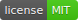

# Decent macOS

> Not awesome but a variety of decent enough macOS advanced setting from 3rd party applications

## Featuring Apps

![Open-Source Software][OSS Icon] means **open source**, click to open **open source** repo

![Freeware][Freeware Icon] means **free** to use, or **free** personal license

![Paid/In-app Purchase][Paid Icon] means **paid** or has limited functions with **in-app purchases**

- [Alfred](./alfred/README.md) – An award-winning app for macOS which boosts your efficiency with hotkeys, keywords, text expansion and more. Search your Mac and the web, and be more productive with custom actions to control your Mac. [![Paid/In-app Purchases][Paid Icon]](https://www.alfredapp.com/)

- [BetterTouchTool](./bettertouchtool/README.md) – A great, feature packed app that allows you to customize various input devices on your Mac. [![Paid/In-app Purchases][Paid Icon]](https://folivora.ai/) 

- [Karabiner-Elements](./karabiner/README.md) - A powerful utility for keyboard customization on macOS Sierra or later. [![Open-Source Software][OSS Icon]](https://github.com/pqrs-org/Karabiner-Elements) [![Freeware][Freeware Icon]]()

- [Espanso](./espanso/README.md) - A cross-platform Text Expander written in Rust. [![Open-Source Software][OSS Icon]](https://github.com/federico-terzi/espanso) [![Freeware][Freeware Icon]]()

---

## License

MIT License

Copyright (c) 2020 Tin Nguyen

Permission is hereby granted, free of charge, to any person obtaining a copy
of this software and associated documentation files (the "Software"), to deal
in the Software without restriction, including without limitation the rights
to use, copy, modify, merge, publish, distribute, sublicense, and/or sell
copies of the Software, and to permit persons to whom the Software is
furnished to do so, subject to the following conditions:

The above copyright notice and this permission notice shall be included in all
copies or substantial portions of the Software.

THE SOFTWARE IS PROVIDED "AS IS", WITHOUT WARRANTY OF ANY KIND, EXPRESS OR
IMPLIED, INCLUDING BUT NOT LIMITED TO THE WARRANTIES OF MERCHANTABILITY,
FITNESS FOR A PARTICULAR PURPOSE AND NONINFRINGEMENT. IN NO EVENT SHALL THE
AUTHORS OR COPYRIGHT HOLDERS BE LIABLE FOR ANY CLAIM, DAMAGES OR OTHER
LIABILITY, WHETHER IN AN ACTION OF CONTRACT, TORT OR OTHERWISE, ARISING FROM,
OUT OF OR IN CONNECTION WITH THE SOFTWARE OR THE USE OR OTHER DEALINGS IN THE
SOFTWARE.

[OSS Icon]: ./docs/assets/oss.svg "Open Source Software"
[Freeware Icon]: ./docs/assets/free.svg "Freeware"
[Paid Icon]: ./docs/assets/paid.svg "Paid/In-app Purchases"