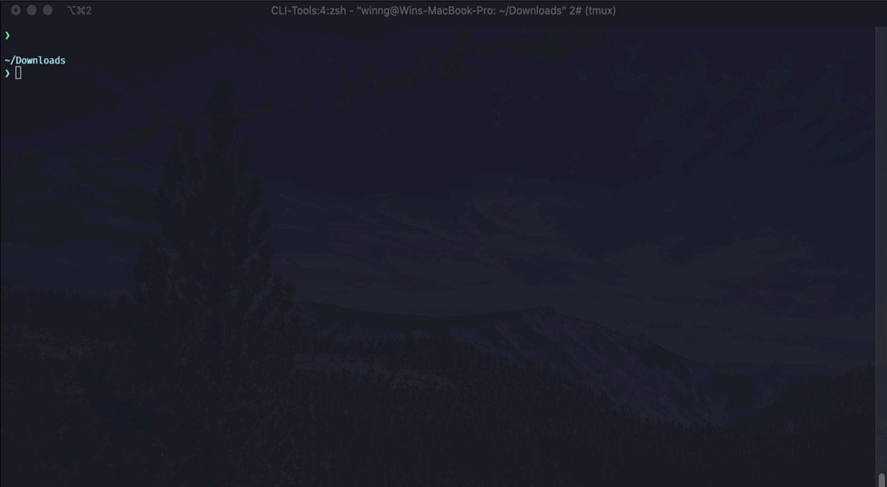

# Alfred 4

> Alfred is an award-winning app for macOS which boosts your efficiency with hotkeys, keywords, text expansion and more. Search your Mac and the web, and be more productive with custom actions to control your Mac.

## Download

You can try Alfred 4 from [official site](https://www.alfredapp.com/) and its essential [Powerpack](https://www.alfredapp.com/powerpack/).

## Supported systems
- macOS El Capitan (10.11+) or higher for **Alfred 4**

## How To Use

### Folder Structure

```shell
├── README.md
├── snippets
│   ├── Currency Symbols.alfredsnippets
│   ├── Emoji Pack.alfredsnippets
│   ├── Mac symbols.alfredsnippets
│   ├── Math Symbols.alfredsnippets
└── workflows
    └── 
```

### Steps

1. Clone this repo
   
   ```shell
   git clone https://github.com/tinng81/decent-macOS.git && cd alfred
   ```

2. (Snippets) Manually select each collection (`.alfredsnippets`) or run this
   
   ```shell
   # Automatically unload all snippets to the default location of Alfred Snippet Collections
   # NOTE be careful with this method as it will ask to 
   # overwrite existed/duplicated collections based on their name
   for file in snippets/*.alfredsnippets; do mkdir -p "${file%.*}" && unzip -q "$file" -d "${file%.*}" && mv "${file%.*}" ~/Library/Application\ Support/Alfred/Alfred.alfredpreferences/snippets/; done
   ```

## Features

---

## Snippets

### Mac symbols.alfredsnippets  |  [Download](./alfred/snippets/Mac%20symbols.alfredsnippets)

> Native macOS symbols such as ALT SHIFT CMD CTRL Up Down (⌥ ⇪ ⌘ ⌃ ⌫ ↓ ↑)

### Math Symbols.alfredsnippets  |  [Download](./alfred/snippets/Math%20Symbols.alfredsnippets)

> LaTeX-like syntax `\\` for arithmetics (½ ≤ ℃), Latin/Greek symbols (∮ π), superscript and ssubscript

### Currency Symbols.alfredsnippets  |  [Download](./alfred/snippets/Currency%20Symbols.alfredsnippets)

> Common currencies such as USD $, EUR €, GBP £, KRW ₩

### Emoji Pack.alfredsnippets  |  [Download](./alfred/snippets/Emoji%20Pack.alfredsnippets)

> GitHub, Twitter compatible emoji pack

---

## Workflows

Most of the workflows are configured with a hotkey using Hyper key from the [Karabiner setting](./karabiner#caps_lock_hyper_keyjson).

### Switch Keyboard Language  |  [Download](./alfred/workflows/Switch%20Keyboard%20Language.alfredworkflow)  |  [Repo](https://github.com/andynil/alfred-switch-keyboard-language)

> Quickly define and change macOS keyboard input language, came with English/Australian/German/Russian/Korean/Vietnamese language bundled

[](./docs/assets/alfred_switch_keyboard_language.gif)

### Show Network Info  |  [Download](./alfred/workflows/Show%20Network%20Info.alfredworkflow)  |  [Repo](https://github.com/jeppestaerk/alfred-show-network-info)

> Show local/global IP addresses and quickly scan local devices with arp

[](./docs/assets/alfred_show_network_info.gif)

### Menu-Bar-Search  |  [Download](./alfred/workflows/Menu%20Bar%20Search.alfredworkflow)  |  [Repo](https://github.com/BenziAhamed/Menu-Bar-Search)

> Quickly search the menu bar of frontmost application and activate functions with hotkey `Hyper + m` or keyword `m`

[](./docs/assets/alfred_menu_bar_search.gif)

### Open With VSCodium  |  [Download](./alfred/workflows/Open%20with%20VSCodium.alfredworkflow)

> Open file from fuzzy search in Visual Code Codium with `code` command or as a File Action from selected file

[](./docs/assets/alfred_open_with_vscodium.gif)

## Disclaimer

- These configurations serve more as an archive rather than active development and all credits go towards the [original developers](#Download).

## License

MIT © Tin Nguyen
