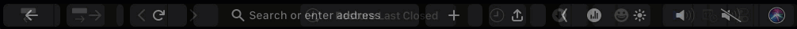

# BetterTouchTool

> BetterTouchTool is is a great, feature packed app that allows you to customize various input devices on your Mac. Currently BetterTouchTool supports:
> 
> - Macbook Trackpad
> - Magic Trackpad 1 & 2
> - Magic Mouse 1 & 2
> - Touch Bar customization
> - Siri/Apple Remote
> - Normal Mouse Gestures
> - Normal Mouse Buttons
> - Keyboard Shortcuts
> - Key Sequences / Text Triggers


## Download

You can download BetterTouchTool from [official site](https://folivora.ai/downloads) and the [original Aquatouch Preset](https://community.folivora.ai/t/v3-6-5-aquatouch-powerful-flexible-contextual-supports-55-apps-and-websites/1704/2) or try out the archived version as following.

## Supported systems
- macOS Yosemite (10.10) or higher, including the M1 Chip macOS

## How To Use

### Folder Structure

```shell
├── README.md
├── AquaTouch v3.6.2.bttpresetzip
├── SnapAreas.bttpreset
```

### Steps

1. Clone this repo
   
   ```shell
   git clone https://github.com/tinng81/decent-macOS.git && cd bettertouchtool
   ```
2. Import both by double-click or `Open with` BetterTouchTool

3. Tick the boxes under Enable/Visible UI in `BetterTouchTool > Preset > Configuration`

## Features

### Touch bar preset AquaTouch

> This preset supports 55 Applications and Websites

[](https://github.com/tinng81/decent-macOS/docs/assets/btt_aquatouch_preset.gif)

### Border & Custom Snap Areas

> Native support of BTT to define custom snap areas on multiple monitors

[](https://github.com/tinng81/decent-macOS/docs/assets/btt_snap_areas.gif)

## Disclaimer

- These configurations serve more as an archive rather than active development and all credits go towards the [original developers](#Download).

## License

MIT © Tin Nguyen
