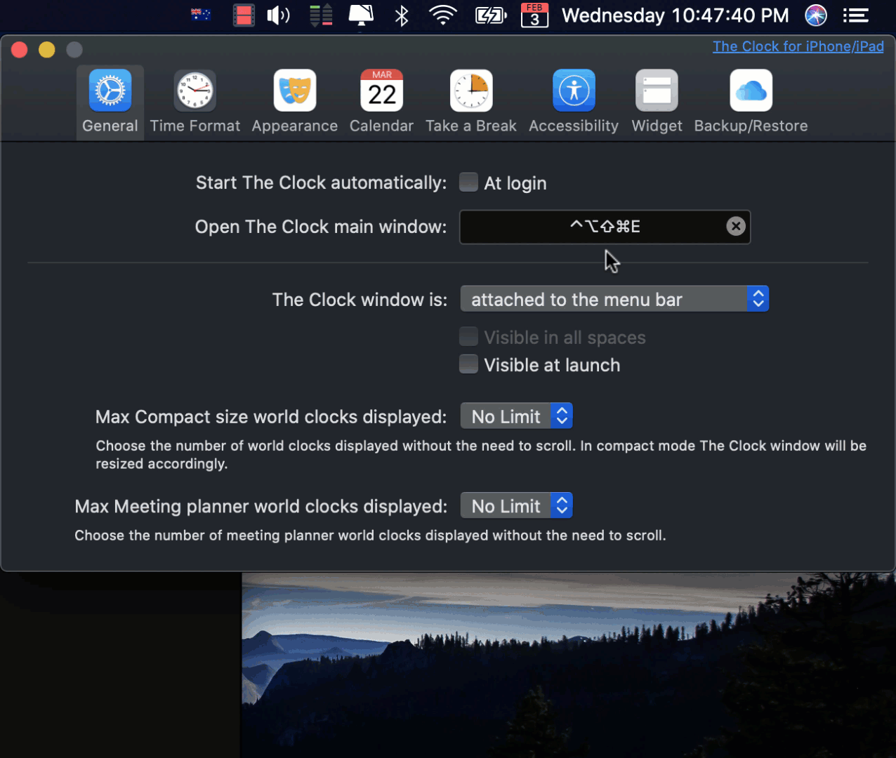

# Karabiner-Elements

> Karabiner-Elements is a powerful utility for keyboard customization on macOS Sierra or later.

## Download

You can download Karabiner-Elements from [official site](https://karabiner-elements.pqrs.org/).

## Supported systems

- macOS Sierra (10.12)
- macOS High Sierra (10.13)
- macOS Mojave (10.14)
- macOS Catalina (10.15)

## How To Use

### Folder Structure

```shell
├── README.md
├── generated_config.json
├── lib
│   ├── erb2json.rb
│   └── karabiner.rb
└── template
    ├── template.rb
    └── template.erb
```

### Steps

1. Clone this repo
   
   ```shell
   git clone https://github.com/tinng81/decent-macOS.git && cd karabiner
   ```
2. Generate config files (if modified)
   
   ```shell
   # Example for ERB template
   ruby ./lib/erb2json.rb < ./template/function_keys_v2.erb > function_keys_v2.json
   
   # Example for normal script
   ruby ./template/app_launcher_v4.rb > app_launcher_v4.json
   ```
3. Copy to your local Karabiner config directory
   
   ```shell
   # Default location
   mv *.json ~./config/karabiner/assets/complex_modifications
   ```
4. Enable it in `Karabiner-Elements > Complex Modifications > Add Rule`

## Features

### remap_wireless_diag.json (new)

> Remap all system diagnostics to Function Keys (F17, F18, F19)

[](https://github.com/tinng81/decent-macOS/docs/assets/karabiner_remap_diagnostics.gif)

### vi_mode.json (new)

> System-wide options holding keyword `f` to enter Vi Navigation mode with `HJKL` and similarly `fd` for `Home/PageDown/PageUp/End`. Also support Visual `v` text selection mode.

#
### tilde_spotlight.json (new)

> Double-click grave-and-title-accent key mapped to CMD+Space, otherwise send normal accent key

### app_launcher_v4.rb

> Quick launch any application via a shortcut Hyper + O. NOTE: must enable caps_lock_hyper_key first

### caps_lock_hyper_key.json 

> Using Caplocks as a Hyper key for CMD + CTRL + ALT + SHIFT (⌘ + ⌃ + ⌥ + ⇧) and toggle Caplock by Shift + Caplock

### function_keys_v2.erb

> Turning all control keys to function keys [F1-F12] only when specific frontmost applications, specifically Virtual Machine.

## Notes

- One config file may contains several configuration and can be either enabled individually or `Enable All` in [Step 4](###Steps).

- Step 4 is an addition of "user-friendly" approach and safer than directly edit the main configuration `karabiner.json` file. Be advised and only do so if you know what you're doing. If you can create an auto-merge script for generated json, Pull Requests are more than welcomes.

## License

MIT © Tin Nguyen
